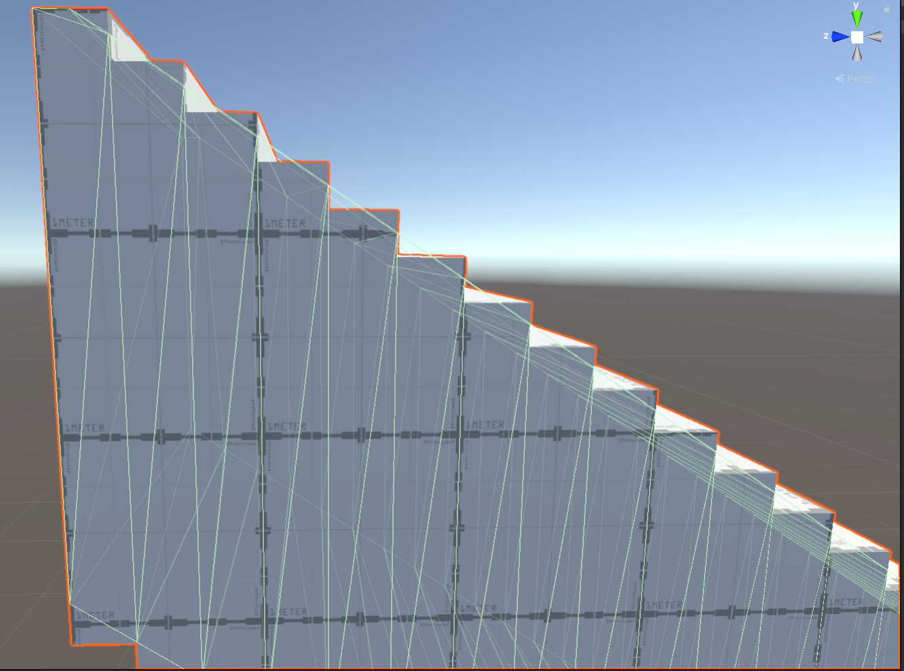

# Project Documentation

# 1st day - 6th of January - Getting back to Unity and first Probuilder Experiments

The first day I took back to unity.   
I did a little bit of research this week and decided that I'd use the Probuilder package to build the environments for my projects. Probuilder should be sufficient since I only need the most basic geometric shapes (and I don't have the time for another program anyways). I watched [this video tutorial](https://www.youtube.com/watch?v=YtzIXCKr8Wo&list=PLMUuuDyzvcZLwoSLUPjFcjSvookPWgLz8&index=3&t=873s), which was ok, and created my first "level". 

During this ordeal, I noticed that the navigation in Unity is still quite a hassle for me, so I read [this part of the manual.](https://docs.unity3d.com/Manual/SceneViewNavigation.html)

## 2nd day - 7th of January	- Further Probuilder Experiments and an Inspiring Tutorial

I returned to my level and played a bit more with the different Probuilder tools after reading the [Probuilder documentation](https://unity-technologies.github.io/procore-legacy-docs/probuilder/probuilder2-gh-pages/). During a break, I stumbled upon [this tutorial series on movement and gravitation by Jasper Flick](https://catlikecoding.com/unity/tutorials/movement/), which inspired me a lot. I've decided to include Super Mario Galaxy-esque movement in my project. I also came up with the basic "plot" and context for the project, which eases the gloominess of the initial idea a bit. I've written about that in [my project plan here.](../project_plan/project_plan.md) 

## 8th + 9th of January - The Pain and Joy of being a Probuilder

I started a new scene with the idea to try some of the shapes that I'd use in my project, but it quickly evolved into something a bit more serious. I tried to recreate the structure from this panel:

I still struggled with the more advanced Probuilder features a lot - the basics seem to be much more reliable for my needs. I installed Progrids and read [the manual](https://docs.unity3d.com/Packages/com.unity.progrids@3.0/manual/index.html) so that I can easily snap objects together. After I while, I decided that it'd be smart to build my own reusable assets that I could snap together like LEGO bricks. I still don't entirely understand the concept of prefabs, but I got it working for me. To build some of the more complex (for me) assets, I looked into the experimental Boolean features of Probuilder after watching [this tutorial](https://www.youtube.com/watch?v=SpQsbqxAK4I&list=PLMUuuDyzvcZLwoSLUPjFcjSvookPWgLz8&index=4&t=224s). They seemed to be exactly what I needed, but there's a reason that they're an experimental feature. Most of the time, they immediately crashed my project. In the other cases, they just created an empty game object. I'll stick to my Minecraft approach. In the end, I ended up with this:

I'm quite happy with that tbh. I thought about using a shader to improve the visuals without looking into lighting just yet. I found this shader, which might prove useful to get very close to Miura’s drawings, in case I want that.

At this point, I'm confident that I can build the environment as long as I got a nice copy and paste asset-based workflow going.

## Interim  10th - 12th of January - Creating the Project Plan Presentation

For my project plan presentation, I generated a bunch of additional ideas and structered them in a more cohesive way.  
You can find the result [here.](../project_plan/project_plan.md)

## 15th + 16th + 17th of January - The Pain ~~and Joy~~ of being a Probuilder Pt. II; First Shader Experiments

When I returned to my scene, I noticed lots of texture glitching and other artifacts. The culprits were lots and lots of overlapping faces. I created my assets by merging multiple primitves together, but unforntunately Probuilder does not simplify the resulting new object. Everything simply get's glued together. After loosing lots of hair, I seemingly soved the issue by merging the faces that I want the keep, detaching said faces and merging the detached faces back into new object. 

I decided to play around with materials by [Julio Sillet](https://juliosillet.gumroad.com/), but I didn't really like the outcomes. Instead, I purchased this [manga shader](https://assetstore.unity.com/packages/vfx/shaders/unchi-manga-shader-8504). I played around it quite a bit and got some nice results. HOWEVER, the shader revealed further imperfections in my assets: 

There are simply too many random vertecies in my assets due to the merging approach and some of the interior faces were still left. I decided to scrap all the assets I've build so far and started from scratch. I hate my entire existence. 

Since I couldn't rely on merging multiple objects together anymore, I had to rely on transforming the Probuilder primitives. This wouldn't be that much of an issue if the most of the Probuilder features would actually work. For example, the "Fill Holes" functionality crashes my project 90% of the time. For the remaining 10% it does something completely unexpected or nothing at all. 

Honestly, I would not recommend Probuilder. After Orkun's introduction, I researched whether there is a similar tool in Unreal and found out that Probuilder is a less sophisticated imitation of Unreal's [Geometry Brush Actors.](https://docs.unrealengine.com/4.27/en-US/Basics/Actors/Brushes/) Welp, I guess there is always another project...

## Interim II 19th + 20th of January - Creating this Documentation
I've decided to not use the Wiki since I didn't find a way to easily access it inside of VS Code.

## 27th + 28th of January - Enough Assets (for now)
I've created all the assets I want for now without any overlapping faces etc. They might not look spectacular and there are lots of seemingly similar arches for slightly different uses. BUT THEY ARE MINE ASSETS AND I'M VERY PROUD:

Except for the stupid pillar, they also look pretty good with my current shader settings. It's obviously not a very realistic look, but I like how the spikes on the bridge contrast so nicely for example. I'll see whether I'll stay with this look or not later, it all depends on the lighting.
  

## 28th of February + 1st of March - Movement

After the other final projects and an unfortunate corona-break, I'm finally back on this project.  
I started going through the movement tutorial series by catlikecoding. 
I also once again adjusted my assets so that player controller can slide up the stairs on a ramp:

The mesh collider is a bit messy, but it gets the job done and I don't have the time to dwell on this. 

## 2nd + 3rd of March - Gravity

I looked into how to switch the gravitation. One problem that I encountered was the rotation of a the player controller while walking around a planet. I didn't manage to allign the camera with the gravity so now I simply use a sphere with a camera inside instead. A bit like in Super Monkey Ball:

I think I could achieve the ideal Super Mario Galaxy solution with more time, but this was the most simple fix. The obvious downside is that the radius of the player controller is quite huge as a result, but for my simple "game" it shouldn't be an issue. The adjustment of the camera is still a bit janky when switching between different gravities. 

I experimented a lot and now I'm confident that I can implement lots of gravity switching quite easily. I'm a bit ashamed how relient I am on the catlikecoding tutorials. But I also have to admit that I'd see it as quite boring to work on my movement scripts for a month - I'm more of a visual guy after all. 

## 4th of March - rack up

I copied all the movement, camera and gravity scrips into my inital project and started to build the beginning of my scene. I had to fix some of my assets again (does this nightmare never end?) and played some more with the parameters of the player controller, but all the basics are now in place. I'll now look into the visuals before I build the entirety of the scene. 

## 5th of March - More asset shenanigans

I wanted to start the look development today, but quickly noticed that some of my assets would flicker like hell when lighted with non-directional lights at certain angles. I spend the entire day fixing this...
Probuilder should not exist. 

## 6th of March - Look Development and breakthrough

I finally took the dive into [Unity's High Definition Render Pipeline (HDRP)](https://docs.unity3d.com/Packages/com.unity.render-pipelines.high-definition@6.9/manual/HDRP-Features.html).  
So far, my whole experience with Unity was very unpleasent, so my expectations for the look development were also very low. But instead of the expected lack of expected features and obscure parameters, I was presented with an amazing set of extensive features that are hands-on but still deep enough if needed.
In addition to the documentation, [this official tutorial proved also to be quite useful](https://www.youtube.com/watch?v=yqCHiZrgKzs&t=1516s). 
I ended up with this look:

One thing the HDRP is very good at is mixing realistic physics-based lighting and effects with other settings that are not realistic at all. Many parameters are already well known from real-life cameras and lights. 
I twiddled away for hours and slowly gravitated to the look above and differs quite a bit from my initial moodboard.
One reason for this is that the HDRP is AMAZING at imitating the warm look of fuzzy old lightbulbs. 
The other one is probably my eternal love for Journey by Thatgamecompany:

In ten years I'll be there...  
The HDRP makes it super easy to find a unique style. All the tools I wanted (and more) are here and work out of the box. Even the silly film grain. The volumetric fog/light was so easy to setup. 
Compared to everything else, I had much much more fun with this and I'm super fascinated by this topic. It didn't feel like work at all. 

## 7th of March - Trail of Lights.

With this new-found enthusiasm, I battled the trail renderer.   
I looked into the shader-graph and some examples for custom trails, but wasn't too impressed.  
I didn't find anything that could fit the style of my project and didn't want to overwrite my default HDRP shader out of fear that I might loose cohesion. So I tried out the default trail renderer and was pleasently surprised.  
The default trail renderer has a pretty poor reputation, but in combination with the HDRP it can look very beautiful.  
My first attempt was to just throw my standard material onto the trail and it was quite nice due to the lights and shadows: 

Looks a bit like wires and I like that effect, but it's not really a trail of lights. The trail renderer can only render lines and not dots (unless you use a custom texture I assume), but I can use this to my advantage by putting an emmissive material on a very thin trail. Combined with all the visueal effects and a modulated width, the trail looks like a mixture of single chained lights and thicker light-rays:   
  
Thanks to a visual glicht, this trail flickers constantly, but that actually looks really good thanks to the anti-aliasing! The trail never looks sharp even with all the post-processing turned off. I guess light just isn't sharp? The look might be improved with a higher quality noise texture for the fog, but even my PC wouldn't be able to handle that.  
Both options have the same performance cost (with the shadow-cast turned off), so it's very hard for me decide which one to choose. Woe is me...

