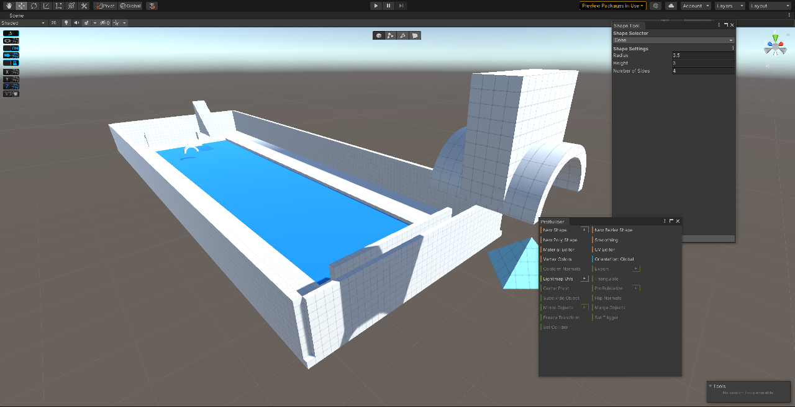

# Project Documentation

# 1st day - 6th of January - Getting back to Unity and first Probuilder Experiments

The first day I took back to unity.   
I did a little bit of research this week and decided that I'd use the Probuilder package to build the environments for my projects. Probuilder should be sufficient since I only need the most basic geometric shapes (and I don't have the time for another program anyways). I watched [this video tutorial](https://www.youtube.com/watch?v=YtzIXCKr8Wo&list=PLMUuuDyzvcZLwoSLUPjFcjSvookPWgLz8&index=3&t=873s), which was ok, and created my first "level". 

During this ordeal, I noticed that the navigation in Unity is still quite a hassle for me, so I read [this part of the manual.](https://docs.unity3d.com/Manual/SceneViewNavigation.html)

## 2nd day - 7th of January	- Further Probuilder Experiments and an Inspiring Tutorial

I returned to my level and played a bit more with the different Probuilder tools after reading the [Probuilder documentation](https://unity-technologies.github.io/procore-legacy-docs/probuilder/probuilder2-gh-pages/). During a break, I stumbled upon [this tutorial series on movement and gravitation by Jasper Flick](https://catlikecoding.com/unity/tutorials/movement/), which inspired me a lot. I've decided to include Super Mario Galaxy-esque movement in my project. I also came up with the basic "plot" and context for the project, which eases the gloominess of the initial idea a bit. I've written about that in my project plan here. 

## 3rd + 4th day - 8th + 9th of January - The Pain and Joy of being a Probuilder

I started a new scene with the idea to try some of the shapes that I'd use in my project, but it quickly evolved into something a bit more serious. I tried to recreate the structure from this panel:

I still struggled with the more advanced Probuilder features a lot - the basics seem to be much more reliable for my needs. I installed Progrids and read [the manual](https://docs.unity3d.com/Packages/com.unity.progrids@3.0/manual/index.html) so that I can easily snap objects together. After I while, I decided that it'd be smart to build my own reusable assets that I could snap together like LEGO bricks. I still don't entirely understand the concept of prefabs, but I got it working for me. To build some of the more complex (for me) assets, I looked into the experimental Boolean features of Probuilder after watching [this tutorial](https://www.youtube.com/watch?v=SpQsbqxAK4I&list=PLMUuuDyzvcZLwoSLUPjFcjSvookPWgLz8&index=4&t=224s). They seemed to be exactly what I needed, but there's a reason that they're an experimental feature. Most of the time, they immediately crashed my project. In the other cases, they just created an empty game object. I'll stick to my Minecraft approach. In the end, I ended up with this:

I'm quite happy with that tbh. I thought about using a shader to improve the visuals without looking into lighting just yet. I found this shader, which might prove useful to get very close to Miura’s drawings, in case I want that.

At this point, I'm confident that I can build the environment as long as I got a nice copy and paste asset-based workflow going.
